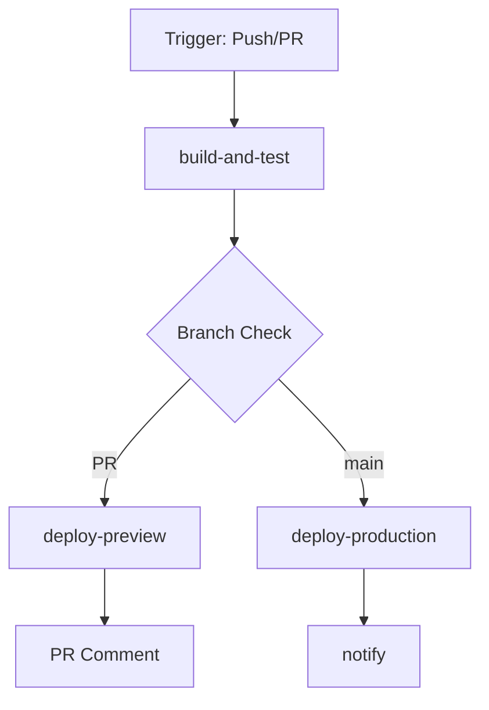

# CI/CD Pipeline Documentation

## Overview

This directory contains the GitHub Actions workflows for the Luminari Wilderness Editor monorepo. The pipeline provides automated testing, security scanning, and deployment to Netlify.

## Workflow Files

### `ci.yml` - Main CI/CD Pipeline
The primary workflow that handles:
- Linting and code quality checks
- Type checking
- Unit tests
- Security audits
- Build verification
- PR preview deployments
- Production deployments
- Slack notifications

### `ci-original.yml` - Backup
Original workflow file kept for reference (can be deleted after verifying new workflow works correctly).

## Key Features

### 🚀 Performance Optimizations
- **Dependency Caching**: Uses GitHub Actions cache to store npm dependencies
- **Artifact Sharing**: Build artifacts are shared between jobs to avoid rebuilding
- **Combined Jobs**: Related tasks are grouped to minimize overhead
- **Conditional Installation**: Dependencies only installed when cache miss occurs

### 🔒 Security
- **Vulnerability Scanning**: `npm audit` checks for known vulnerabilities
- **Audit CI**: Additional security scanning with configurable thresholds
- **No Security Bypass**: Security failures block deployment (no `continue-on-error`)

### 🌐 Deployment Features
- **PR Preview Deployments**: Every PR gets its own preview URL
- **Production Deployments**: Automatic deployment to production on merge to main
- **Environment Protection**: Production deployments use GitHub environment protection rules
- **Deployment Comments**: PRs receive comments with preview URLs

### 📊 Monitoring
- **Slack Notifications**: Optional deployment notifications
- **GitHub Releases**: Automatic release creation for tagged commits
- **Build Artifacts**: 7-day retention for debugging

## Configuration

### Required Secrets
See [SECRETS_SETUP.md](../SECRETS_SETUP.md) for detailed setup instructions.

Minimal required secrets:
- `NETLIFY_AUTH_TOKEN`
- `NETLIFY_PROD_SITE_ID`

### Environment Variables
The workflow automatically provides sensible defaults for all environment variables. Production values can be overridden using GitHub secrets.

## Workflow Triggers

- **Push to main/develop**: Full pipeline with deployment
- **Pull Request**: Build, test, and preview deployment
- **Tag push**: Additional GitHub release creation

## Job Structure

## Maintenance

### Cache Busting
To clear caches, increment the `CACHE_VERSION` environment variable in the workflow file.

### Updating Dependencies
The workflow uses `npm ci` for consistent, reproducible builds. Update `package-lock.json` locally and commit to update dependencies.

### Debugging Failed Builds
1. Check the GitHub Actions logs
2. Download build artifacts if available
3. Run the same commands locally to reproduce
4. Check secret configuration if authentication errors occur

## Best Practices

1. **Keep Jobs Focused**: Each job should have a single responsibility
2. **Use Caching**: Always cache dependencies and build artifacts
3. **Fail Fast**: Security and quality checks should run early
4. **Document Secrets**: Keep SECRETS_SETUP.md up to date
5. **Monitor Performance**: Track pipeline duration and optimize bottlenecks

## Recent Improvements (2025-07-31)

- ✅ Fixed Netlify deployment command (removed invalid `--filter` flag)
- ✅ Updated port references from 3001 to 8000
- ✅ Removed security audit bypass
- ✅ Implemented proper dependency caching
- ✅ Added PR preview deployments
- ✅ Combined jobs for better performance
- ✅ Added comprehensive documentation

## Troubleshooting

### Common Issues

**"Netlify site not found"**
- Check `NETLIFY_PROD_SITE_ID` is correctly set
- Verify site exists in Netlify dashboard

**"npm audit found vulnerabilities"**
- Run `npm audit fix` locally
- Update dependencies if needed
- Document false positives in `audit-ci.json`

**"Cache not working"**
- Check `package-lock.json` hasn't changed
- Verify cache key format is correct
- Try incrementing `CACHE_VERSION`

## Support

For issues with the CI/CD pipeline:
1. Check this documentation
2. Review GitHub Actions logs
3. Consult the [main project documentation](../../docs/)