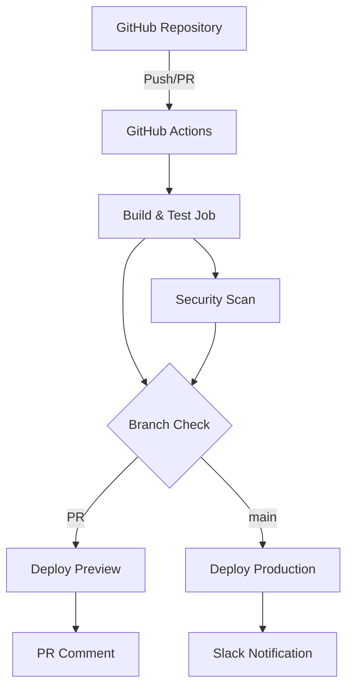
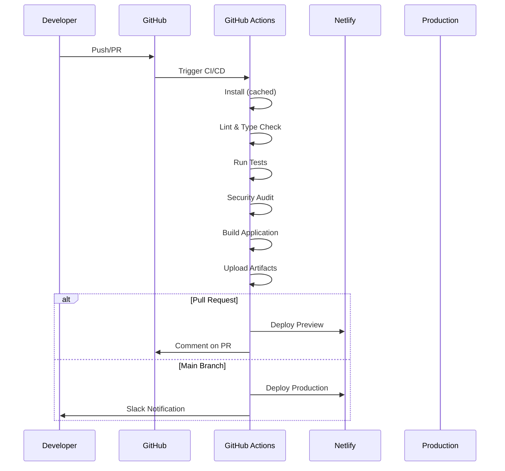

# Frontend CI/CD System Documentation

## Table of Contents
1. [Executive Summary](#executive-summary)
2. [CI/CD Architecture Overview](#cicd-architecture-overview)
3. [Current Implementation](#current-implementation)
4. [Environment Configuration](#environment-configuration)
5. [Deployment Process Flow](#deployment-process-flow)
6. [Security Features](#security-features)
7. [Performance Optimizations](#performance-optimizations)
8. [Best Practices](#best-practices)
9. [Troubleshooting Guide](#troubleshooting-guide)

## Executive Summary

This document describes the CI/CD system for the Luminari Wilderness Editor frontend application within a monorepo structure.

### Current Status
- **Platform**: GitHub Actions + Netlify deployment
- **Status**: Fully implemented and production-ready
- **Performance**: Optimized with caching and artifact sharing
- **Security**: Comprehensive vulnerability scanning

## CI/CD Architecture Overview

### Technology Stack
- **CI Platform**: GitHub Actions
- **CD Platform**: Netlify (CLI-based deployment)
- **Build Tool**: Vite 7.0
- **Package Manager**: npm (with workspaces)
- **Monorepo Tool**: Turborepo
- **Node Version**: 18.x

### System Components



## Current Implementation

### GitHub Actions Workflow

#### Workflow File: `.github/workflows/ci.yml`
- **Triggers**: Push to main/develop, PR to main/develop
- **Jobs**: build-and-test, deploy-preview, deploy-production, notify

#### Key Features
1. **Combined build-and-test job** for efficiency
2. **Dependency caching** with GitHub Actions cache
3. **Artifact sharing** between jobs
4. **PR preview deployments** with automatic comments
5. **Production deployments** with environment protection

### Netlify Configuration

#### Location: `apps/frontend/netlify.toml`
```toml
[build]
  base = ""
  command = "npm run build"
  publish = "apps/frontend/dist"
  NODE_VERSION = "18"
  
[build.environment]
  NPM_FLAGS = "--legacy-peer-deps"
  CI = "true"
  NODE_ENV = "production"
```

## Environment Configuration

### Required Secrets

Complete documentation available in `.github/SECRETS_SETUP.md`

| Secret | Purpose | Required |
|--------|---------|----------|
| `NETLIFY_AUTH_TOKEN` | Netlify authentication | ✅ Yes |
| `NETLIFY_PROD_SITE_ID` | Production site identifier | ✅ Yes |
| `PROD_API_URL` | Production API endpoint | ❌ No (has default) |
| `PROD_SUPABASE_URL` | Production Supabase URL | ❌ No |
| `PROD_SUPABASE_ANON_KEY` | Production Supabase key | ❌ No |
| `SLACK_WEBHOOK_URL` | Deployment notifications | ❌ No |

### Environment Variables

```bash
# Frontend Configuration
VITE_API_URL=http://localhost:8000/api
VITE_SUPABASE_URL=your_supabase_project_url
VITE_SUPABASE_ANON_KEY=your_supabase_anon_key
```

## Deployment Process Flow



## Security Features

### Implemented Security Measures
- ✅ **Dependency vulnerability scanning** (npm audit)
- ✅ **Audit CI** for configurable vulnerability thresholds
- ✅ **TypeScript type checking**
- ✅ **ESLint code quality checks**
- ✅ **Security headers** in Netlify configuration
- ✅ **HTTPS enforcement** in production
- ✅ **No security bypasses** - audits block deployment

### Security Headers (netlify.toml)
- X-Frame-Options: DENY
- X-XSS-Protection: 1; mode=block
- X-Content-Type-Options: nosniff
- Referrer-Policy: strict-origin-when-cross-origin
- Content-Security-Policy: Configured for app requirements

## Performance Optimizations

### Implemented Optimizations

1. **Dependency Caching**
   - npm cache preserved between runs
   - Full node_modules cached
   - Cache key based on package-lock.json

2. **Artifact Sharing**
   - Build artifacts uploaded once
   - Reused in deployment jobs
   - 7-day retention for debugging

3. **Conditional Installation**
   - Dependencies only installed on cache miss
   - Saves 2-3 minutes per build

4. **Combined Jobs**
   - Lint, test, and build in single job
   - Reduces overhead and duplication

## Best Practices

### Workflow Management
1. **Cache versioning** - Use `CACHE_VERSION` env var for cache busting
2. **Fail fast** - Security and quality checks run early
3. **Environment protection** - Production requires approval
4. **Artifact retention** - Keep builds for debugging

### Development Workflow
1. **Feature branches** → PR → Preview deployment
2. **Code review** with preview URL
3. **Merge to main** → Automatic production deployment
4. **Monitoring** via Slack notifications

### Secret Management
1. Use GitHub repository secrets
2. Separate production and development values
3. Document all required secrets
4. Regular rotation schedule

## Troubleshooting Guide

### Common Issues

#### Netlify Deployment Fails
```bash
Error: No Netlify configuration found
```
**Solution**: The workflow correctly changes to `apps/frontend` directory before deploying.

#### Environment Variables Undefined
```bash
VITE_API_URL is undefined
```
**Solution**: Check GitHub Secrets configuration. The workflow provides sensible defaults.

#### Build Artifacts Missing
```bash
Error downloading artifacts
```
**Solution**: Ensure the build-and-test job completed successfully.

#### Security Audit Blocks Deployment
```bash
found 3 high severity vulnerabilities
```
**Solution**: 
1. Run `npm audit fix` locally
2. Update dependencies if safe
3. Configure `audit-ci.json` for false positives

### Debug Commands

```bash
# Check Netlify configuration
netlify build --dry
netlify status

# Test build locally
npm run build

# Check for vulnerabilities
npm audit
npx audit-ci --config audit-ci.json

# Verify monorepo setup
npm list --workspaces
```

## Future Enhancements

### Potential Improvements
1. **E2E Testing** - Add Playwright or Cypress tests
2. **Performance Monitoring** - Lighthouse CI integration
3. **SAST Scanning** - Static security analysis
4. **Blue-Green Deployments** - Gradual rollouts
5. **Deployment Rollback** - Automatic rollback on errors

### Monitoring Additions
1. **Build time tracking**
2. **Deployment success rate**
3. **Performance metrics**
4. **Error rate monitoring**

---

**Document Version**: 2.0.0  
**Last Updated**: 2025-07-31  
**Status**: Active  
**Next Review**: 2025-08-31