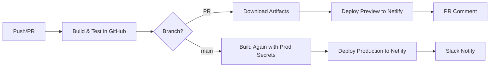

# Frontend CI/CD Guide

## Overview
GitHub Actions + Netlify CI/CD pipeline for Luminari Wilderness Editor frontend.

**Stack**: GitHub Actions, Netlify CLI, Vite 7.0, npm workspaces, Turborepo, Node 18.x

## ⚠️ CRITICAL: How This Actually Works

### The Flow
1. **GitHub Actions** builds the app with secrets from GitHub (NOT Netlify)
2. **Netlify CLI** deploys the pre-built `dist/` folder to Netlify
3. **Netlify** serves the static files (no build happens on Netlify)

### Why This Matters
- GitHub has the Supabase secrets (`VITE_SUPABASE_URL`, `VITE_SUPABASE_ANON_KEY`)
- Netlify does NOT need these secrets (it's just serving static files)
- We do NOT use `netlify deploy --build` because that would bypass GitHub's secrets

## Workflow Files
- **`.github/workflows/ci.yml`**: Main pipeline (lint, test, build, deploy)
- **`.github/workflows/ci-original.yml`**: Backup (remove after verification)

## Required Secrets

### Where Secrets Live
- **GitHub Repository Secrets**: Build-time secrets (Supabase keys)
- **Netlify Dashboard**: NOT NEEDED for env vars (only auth token/site ID)

| Secret | Purpose | Required | Where to Set | Source |
|--------|---------|----------|--------------|--------|
| `NETLIFY_AUTH_TOKEN` | Netlify CLI auth | ✅ | GitHub Secrets | Netlify User Settings → Applications |
| `NETLIFY_PROD_SITE_ID` | Deploy target | ✅ | GitHub Secrets | Netlify Site Settings → General |
| `VITE_SUPABASE_URL` | Supabase URL | ✅* | GitHub Secrets ONLY | Supabase dashboard |
| `VITE_SUPABASE_ANON_KEY` | Supabase key | ✅* | GitHub Secrets ONLY | Supabase Settings → API |
| `PROD_API_URL` | Production API | ❌ | GitHub Secrets | Default: `https://api.wildeditor.luminari.com` |
| `SLACK_WEBHOOK_URL` | Notifications | ❌ | GitHub Secrets | Slack Incoming Webhooks |

*Required for authentication

### ⚠️ IMPORTANT: Environment Variable Flow
```
GitHub Secrets → GitHub Actions Build → Baked into dist/ → Netlify serves static files
```
**DO NOT** set `VITE_*` variables in Netlify dashboard - they won't be used!

## Configuration

### Environment Variables
```bash
# Frontend (.env)
VITE_API_URL=http://localhost:8000/api
VITE_SUPABASE_URL=your_project_url
VITE_SUPABASE_ANON_KEY=your_anon_key

# Workflow
NODE_VERSION=18
CACHE_VERSION=v1
```

### Netlify (`apps/frontend/netlify.toml`)
```toml
[build]
  base = ""
  command = "npm run build"
  publish = "apps/frontend/dist"
  NODE_VERSION = "18"
  ignore_cache = true  # IMPORTANT: Prevents stale builds
  
[build.environment]
  NPM_FLAGS = "--legacy-peer-deps"
  SECRETS_SCAN_OMIT_KEYS = "VITE_SUPABASE_ANON_KEY,VITE_SUPABASE_URL"  # Prevents masking
  CI = "true"
  NODE_ENV = "production"

[[headers]]
  for = "/*"
  [headers.values]
    X-Frame-Options = "DENY"
    X-XSS-Protection = "1; mode=block"
    X-Content-Type-Options = "nosniff"
```

### ⚠️ WARNING: .netlify/ Folder
- Netlify CLI creates `.netlify/netlify.toml` automatically
- This file can BREAK deployments by passing masked env vars
- **Always delete** `.netlify/` folder if you see issues
- Already in `.gitignore` but check it's not committed

## Deployment Flow

### Triggers
- **Push to main**: Production deployment
- **Pull Request**: Preview deployment + PR comment
- **Tag push**: GitHub release

### Process (UPDATED)


### Key Difference: Production Deployment
For production, we:
1. Build AGAIN in the deploy job with production secrets
2. Use `netlify deploy --prod --dir=dist` (NOT `--build`)
3. This ensures env vars are baked into the built files

## Features

### Performance
- npm dependency caching
- Build artifact sharing
- Combined job steps
- **Result**: 50-60% faster builds (2-3 min vs 5-6 min)

### Security
- npm audit (high severity threshold)
- TypeScript strict mode
- ESLint security rules
- Security headers (X-Frame-Options, CSP)
- HTTPS enforcement
- No bypass allowed

### Monitoring
- Slack notifications (optional)
- GitHub releases for tags
- 7-day artifact retention
- Full GitHub Actions logs

## Maintenance

### Schedule
- **Weekly**: Review alerts, check performance, update deps
- **Monthly**: Rotate secrets, update docs, clean artifacts
- **Quarterly**: Major updates, performance review, security audit

### Commands
```bash
# Cache management
CACHE_VERSION=v2  # Increment in workflow
gh actions-cache delete <key>

# Dependencies
npm outdated
npm update
npm audit fix

# Debug
gh run list --workflow=ci.yml
gh run view <id> --log
gh run rerun <id>
```

## Best Practices

### Development
- Test locally first
- Quick checks first
- Document changes

### Security
- Never skip audits
- Rotate secrets (90 days)
- Least privilege
- Review before updating

### Performance
- Cache everything
- Parallelize when possible
- Combine related jobs
- Monitor trends

### Deployment
- Always preview PRs
- Use environments
- Tag releases
- Monitor deployments

## Advanced Options

### E2E Tests
```yaml
- name: E2E Tests
  run: npm run test:e2e
  env:
    PREVIEW_URL: ${{ steps.deploy.outputs.url }}
```

### Lighthouse CI
```yaml
- name: Lighthouse CI
  uses: treosh/lighthouse-ci-action@v9
  with:
    urls: ${{ steps.deploy.outputs.url }}
    uploadArtifacts: true
```

### Custom Notifications
```yaml
- name: Notify
  if: failure()
  run: |
    curl -X POST ${{ secrets.WEBHOOK_URL }} \
      -H "Content-Type: application/json" \
      -d '{"text":"Deploy failed: ${{ github.ref }}"}'
```

## GitHub Secrets Setup

### Add Secrets
1. Repository → Settings → Secrets → Actions
2. Click "New repository secret"
3. Enter name and value
4. Click "Add secret"

### Netlify Token
1. Netlify → User Settings → Applications
2. Personal access tokens → New access token
3. Name it (e.g., "GitHub Actions")
4. Copy immediately

### Netlify Site ID
1. Netlify → Your site → Site settings → General
2. Copy Site ID (format: `12345678-1234-1234-1234-123456789012`)

### Minimal Setup
- `NETLIFY_AUTH_TOKEN`
- `NETLIFY_PROD_SITE_ID`
- `VITE_SUPABASE_URL` (if using auth)
- `VITE_SUPABASE_ANON_KEY` (if using auth)

## ⚠️ Common Issues & Troubleshooting

### Issue: Environment Variables Show as Masked (`****************`)
**Cause**: Netlify CLI masks sensitive values in console output
**Solution**: This is NORMAL in logs, but if values are actually masked in the build:
1. Delete `.netlify/` folder if it exists
2. Ensure you're NOT using `netlify deploy --build`
3. Build must happen in GitHub Actions, not Netlify

### Issue: Supabase Configuration Errors in Production
**Symptoms**: 
- "VITE_SUPABASE_URL doesn't look like a Supabase URL"
- "VITE_SUPABASE_ANON_KEY looks too short"

**Root Causes**:
1. **Netlify CLI Auto-Generated Config**: Delete `apps/frontend/.netlify/netlify.toml`
2. **Wrong Deploy Command**: Must use `netlify deploy --prod --dir=dist` NOT `--build`
3. **Missing GitHub Secrets**: Ensure secrets are set in GitHub repo settings

### Issue: Build Works Locally but Fails in CI/CD
**Check**:
1. Environment variables in GitHub Secrets match local `.env`
2. No `.netlify/` folder committed to git
3. Using correct deploy command (no `--build` flag)

### The Golden Rule
**GitHub builds with secrets → Netlify just serves static files**

Never let Netlify do the building if you need environment variables!

## Support
1. Check this guide
2. [GitHub Actions logs](https://github.com/moshehbenavraham/wildeditor/actions)
3. [Project docs](../README_DOCS.md)
4. [Secrets setup](../../.github/SECRETS_SETUP.md)
5. [Troubleshooting](CI_CD_TODO.md)

---

**Version**: 3.2.0 | **Updated**: 2025-07-31 | **Status**: Active