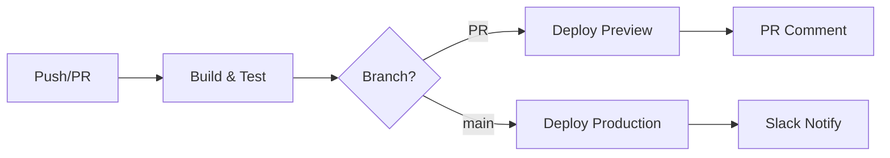

# Frontend CI/CD Guide

## Overview
GitHub Actions + Netlify CI/CD pipeline for Luminari Wilderness Editor frontend.

**Stack**: GitHub Actions, Netlify CLI, Vite 7.0, npm workspaces, Turborepo, Node 18.x

## Workflow Files
- **`.github/workflows/ci.yml`**: Main pipeline (lint, test, build, deploy)
- **`.github/workflows/ci-original.yml`**: Backup (remove after verification)

## Required Secrets

| Secret | Purpose | Required | Source |
|--------|---------|----------|--------|
| `NETLIFY_AUTH_TOKEN` | Netlify auth | ✅ | Netlify User Settings → Applications |
| `NETLIFY_PROD_SITE_ID` | Site ID | ✅ | Netlify Site Settings → General |
| `VITE_SUPABASE_URL` | Supabase URL | ✅* | Supabase dashboard |
| `VITE_SUPABASE_ANON_KEY` | Supabase key | ✅* | Supabase Settings → API |
| `PROD_API_URL` | Production API | ❌ | Default: `https://api.wildeditor.luminari.com` |
| `SLACK_WEBHOOK_URL` | Notifications | ❌ | Slack Incoming Webhooks |

*Required for authentication

## Configuration

### Environment Variables
```bash
# Frontend (.env)
VITE_API_URL=http://localhost:8000/api
VITE_SUPABASE_URL=your_project_url
VITE_SUPABASE_ANON_KEY=your_anon_key

# Workflow
NODE_VERSION=18
CACHE_VERSION=v1
```

### Netlify (`apps/frontend/netlify.toml`)
```toml
[build]
  base = ""
  command = "npm run build"
  publish = "apps/frontend/dist"
  NODE_VERSION = "18"
  
[build.environment]
  NPM_FLAGS = "--legacy-peer-deps"
  CI = "true"
  NODE_ENV = "production"

[[headers]]
  for = "/*"
  [headers.values]
    X-Frame-Options = "DENY"
    X-XSS-Protection = "1; mode=block"
    X-Content-Type-Options = "nosniff"
```

## Deployment Flow

### Triggers
- **Push to main**: Production deployment
- **Pull Request**: Preview deployment + PR comment
- **Tag push**: GitHub release

### Process


## Features

### Performance
- npm dependency caching
- Build artifact sharing
- Combined job steps
- **Result**: 50-60% faster builds (2-3 min vs 5-6 min)

### Security
- npm audit (high severity threshold)
- TypeScript strict mode
- ESLint security rules
- Security headers (X-Frame-Options, CSP)
- HTTPS enforcement
- No bypass allowed

### Monitoring
- Slack notifications (optional)
- GitHub releases for tags
- 7-day artifact retention
- Full GitHub Actions logs

## Maintenance

### Schedule
- **Weekly**: Review alerts, check performance, update deps
- **Monthly**: Rotate secrets, update docs, clean artifacts
- **Quarterly**: Major updates, performance review, security audit

### Commands
```bash
# Cache management
CACHE_VERSION=v2  # Increment in workflow
gh actions-cache delete <key>

# Dependencies
npm outdated
npm update
npm audit fix

# Debug
gh run list --workflow=ci.yml
gh run view <id> --log
gh run rerun <id>
```

## Best Practices

### Development
- Test locally first
- Quick checks first
- Document changes

### Security
- Never skip audits
- Rotate secrets (90 days)
- Least privilege
- Review before updating

### Performance
- Cache everything
- Parallelize when possible
- Combine related jobs
- Monitor trends

### Deployment
- Always preview PRs
- Use environments
- Tag releases
- Monitor deployments

## Advanced Options

### E2E Tests
```yaml
- name: E2E Tests
  run: npm run test:e2e
  env:
    PREVIEW_URL: ${{ steps.deploy.outputs.url }}
```

### Lighthouse CI
```yaml
- name: Lighthouse CI
  uses: treosh/lighthouse-ci-action@v9
  with:
    urls: ${{ steps.deploy.outputs.url }}
    uploadArtifacts: true
```

### Custom Notifications
```yaml
- name: Notify
  if: failure()
  run: |
    curl -X POST ${{ secrets.WEBHOOK_URL }} \
      -H "Content-Type: application/json" \
      -d '{"text":"Deploy failed: ${{ github.ref }}"}'
```

## GitHub Secrets Setup

### Add Secrets
1. Repository → Settings → Secrets → Actions
2. Click "New repository secret"
3. Enter name and value
4. Click "Add secret"

### Netlify Token
1. Netlify → User Settings → Applications
2. Personal access tokens → New access token
3. Name it (e.g., "GitHub Actions")
4. Copy immediately

### Netlify Site ID
1. Netlify → Your site → Site settings → General
2. Copy Site ID (format: `12345678-1234-1234-1234-123456789012`)

### Minimal Setup
- `NETLIFY_AUTH_TOKEN`
- `NETLIFY_PROD_SITE_ID`
- `VITE_SUPABASE_URL` (if using auth)
- `VITE_SUPABASE_ANON_KEY` (if using auth)

## Support
1. Check this guide
2. [GitHub Actions logs](https://github.com/moshehbenavraham/wildeditor/actions)
3. [Project docs](../README_DOCS.md)
4. [Secrets setup](../../.github/SECRETS_SETUP.md)
5. [Troubleshooting](CI_CD_TODO.md)

---

**Version**: 3.1.0 | **Updated**: 2025-07-31 | **Status**: Active